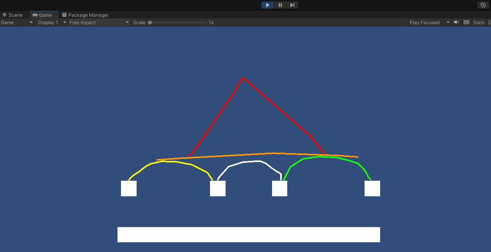
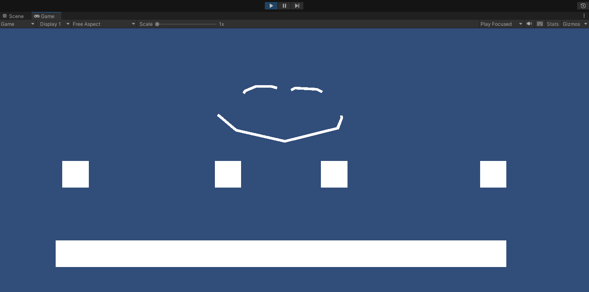

# Drawing Lines 2D

This project allow to draw 2D lines at playtime using point & click system.

## Demo

There is a Github Pages demo available here https://isirode.github.io/DrawingLines2DDemo featuring
* Drawing the lines by clicking, dragging and releasing the mouse's left button
* Free movement using the usual azerty or arrow keys
* Random color pool
* Range limiter

## Main features

The project allow to draw 2D lines with a collider, the collider interact with each others.

Multi-color example:

The project also allow to not setup a collision system for the lines:

Precise and planned features are also available in the [DEVELOPER.md](./DEVELOPER.md) section.

## Running the project

To run the project, open one of the scenes, and use left click + hold (draw), release the clik when you are done.

## Importing the project

You can add this package as a git url : 
- "https://github.com/isirode/DrawingLines2D.git?path=/Assets/Isirode/DrawingLines2D#0.0.1".

The project will be added to your "Packages" folder, the scenes will be read-only, if you want to open them, just copy them in your Assets folder and they will be usable.

You can also download the .unitypackage of the version you want, here for instance https://github.com/isirode/DrawingLines2D/releases/tag/0.0.1 and add it manually to your project. 
This should import the project in your Assets folder.

### Dependencies

It require :
* Mirror : version 2022.10.0 (imported as an asset)
* Unity2DControllers : https://github.com/isirode/Unity2DControllers.git?path=/Assets/Isirode/Unity2DControllers#0.0.1 (import as Git url)

## Know issues

They are cracks in the polygon composite collider (between each segments constituing the lines), it will be fixed in the future.

## Partipating

Open the [DEVELOPER.md](./DEVELOPER.md) section.

